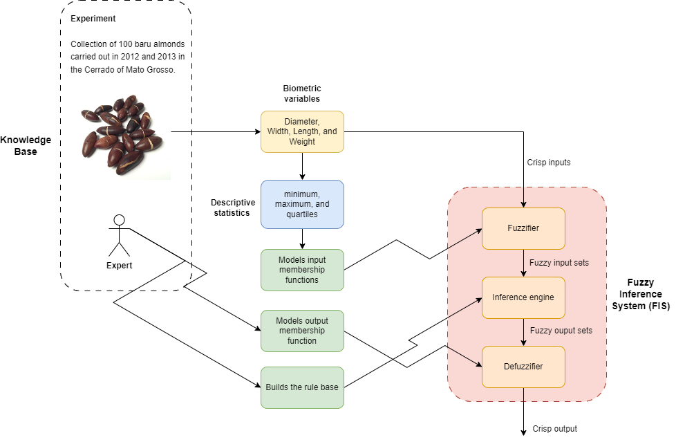

# A baru seed quality index based on a fuzzy inference system

*Abstract:* This study presents a fuzzy inference system (FIS) developed to evaluate the morphological quality of Dipteryx alata (baru) almonds based on four biometric variables: diameter, width, length, and weight. The membership functions were automatically calibrated using descriptive statistics of the dataset, whereas the inference rules were defined by experts. The resulting fuzzy quality index (FQI) effectively captured interannual biometric variability and allowed the identification of almonds with higher and lower morphological qualities at different harvests (2012 and 2023). The centroid-based defuzzification method provided stable and interpretable results, confirming the model’s robustness and suitability for physical quality assessment. The proposed system can serve as an initial morphological filter in sustainable production chains, enabling rapid, transparent, and nondestructive classification of baru almonds and supporting precision agriculture practices.

*Keywords:* Fuzzy Logic; Morphological Quality; Baru Almond; Seed Classification; Precision Agriculture.

